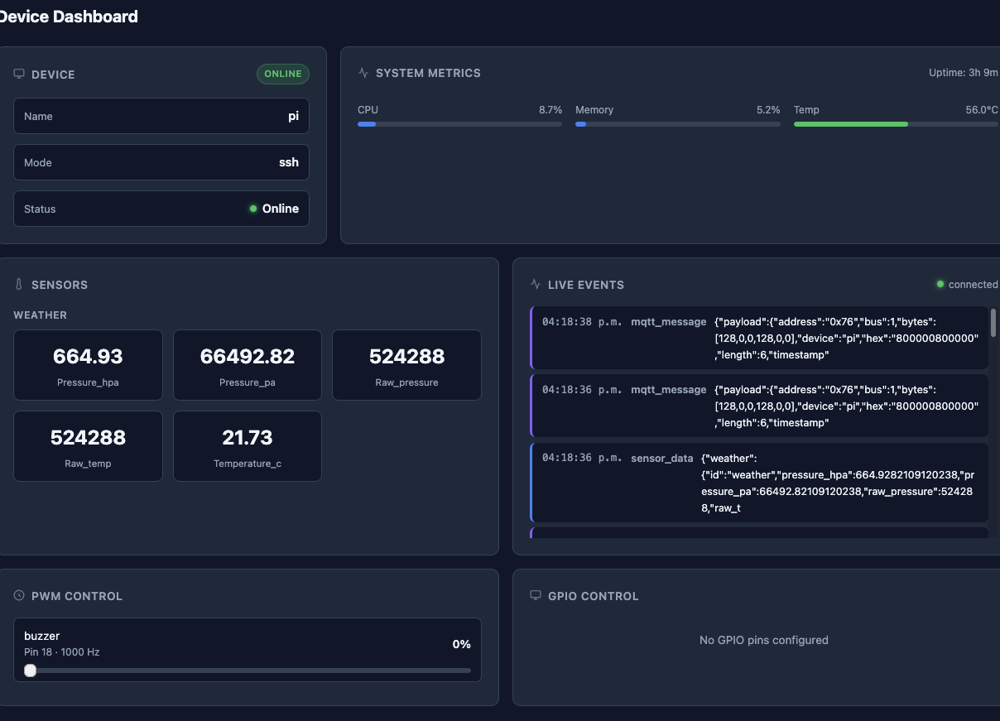

<div align="center">
  # Pi Web

  **A modern web dashboard for Raspberry Pi device control, live monitoring, and user management — built in Go with Fiber, HTMX, WebSockets, JWT auth, and the PIoneer SDK.**

  <p>
    
    
    
    
    
    
  </p>
</div>

---

## Overview

**Pi Web** is a full web interface for managing and monitoring Raspberry Pi-connected devices.

It combines:

- **authentication and authorization**
- **admin/user role separation**
- **live dashboard updates**
- **GPIO and PWM controls**
- **sensor readings**
- **device health and metrics**
- **real-time event streaming**

The hardware layer is powered by **[PIoneer](https://github.com/EraldCaka/PIoneer)**, which handles Raspberry Pi communication and device operations.

---

## Features

### Authentication and Authorization
- user registration and login
- JWT-based authentication
- protected routes
- role-based access control
- admin-only user management

### Dashboard
- live device health
- runtime metrics
- sensor data polling
- GPIO controls
- PWM controls
- real-time event feed over WebSocket

### Admin Panel
- user listing
- role-aware admin access
- user management interface

### Device Integration
- reads device health and metrics
- controls GPIO pins
- controls PWM outputs
- reads sensor data
- uses the **PIoneer** library as the device backend

### Frontend UX
- server-rendered HTML
- HTMX fragments for dynamic updates
- clean responsive layout
- no heavy frontend framework required

---

## Tech Stack

- **Go**
- **Fiber**
- **HTMX**
- **WebSockets**
- **JWT**
- **HTML / CSS**
- **PIoneer**

---

## Architecture

```text
Browser
  ├─ HTMX requests
  ├─ WebSocket live events
  ▼
Pi Web (Fiber)
  ├─ Auth handlers
  ├─ Device handlers
  ├─ Fragment handlers
  ├─ Page handlers
  ├─ JWT middleware
  ▼
PIoneer SDK
  ├─ GPIO
  ├─ PWM
  ├─ Sensors
  ├─ Health / Metrics
  ▼
Raspberry Pi
```

---

## Screenshots

### Dashboard



---

## Key Pages

### Sign In / Register
Users can:
- sign in
- register
- authenticate into the dashboard

### Dashboard
Users can:
- view device health
- view metrics
- monitor sensors
- control GPIO outputs
- control PWM pins
- watch live events in real time

### Admin
Admins can:
- view users
- manage access
- operate with elevated privileges

---

## Project Structure

```text
.
├── internal/
│   ├── handlers/
│   ├── middleware/
│   ├── models/
│   ├── services/
│   └── ...
├── public/
│   └── dashboard.png
├── web/
│   ├── static/
│   └── templates/
├── routes/
│   └── routes.go
└── main.go
```

---

## Routing Overview

### Public
- `GET /` — login/register page
- `GET /health` — health endpoint
- `GET /logout` — logout

### Auth
- `POST /auth/register`
- `POST /auth/login`
- `GET /auth/me`

### Pages
- `GET /dashboard`
- `GET /admin`

### Fragments
- `GET /fragments/health`
- `GET /fragments/metrics`
- `GET /fragments/sensors`
- `GET /fragments/users`

### Device
- `GET /device/health`
- `GET /device/metrics`
- `GET /device/info`
- `GET /device/system-metrics`
- `GET /device/sensors`
- `GET /device/sensors/:id`
- `POST /device/gpio/:pin`
- `POST /device/pwm/:pin`

### Users
- `GET /users/`
- `DELETE /users/:id`
- `POST /users/:id/promote`

### WebSocket
- `GET /ws`

---

## Example Features in the UI

### GPIO Control
Turn configured output pins on and off directly from the dashboard.

### PWM Control
Adjust PWM duty cycle from a slider in the browser.

### Sensor Polling
Read sensors at regular intervals using HTMX fragment refreshes.

### Live Event Feed
See real-time device activity through WebSockets.

---

## Authentication Model

Pi Web includes both:

- **authentication** — identifying the user
- **authorization** — controlling what the user is allowed to access

### Roles
- `admin`
- `user`

### Access Rules
- all authenticated users can access the dashboard
- only admins can access `/admin`
- only admins can manage users

---

## HTMX Usage

HTMX is used for lightweight dynamic updates without a frontend SPA.

Examples:
- health fragment refresh every 10s
- metrics fragment refresh every 10s
- sensors fragment refresh every 5s
- users table lazy-loaded in admin page

This keeps the UI fast and simple while still feeling live.

---

## WebSocket Events

The dashboard opens a WebSocket connection for live device events.

Used for:
- real-time feed updates
- connection state indicator
- event streaming into the UI

---

## Powered by PIoneer

This project uses the **PIoneer** library for Raspberry Pi device communication.

PIoneer provides:
- GPIO control
- PWM control
- sensor access
- device metrics
- health reporting
- Raspberry Pi communication layer

That means **Pi Web** focuses on the web platform and user experience, while **PIoneer** handles the hardware interaction layer.

---

## Why This Project

Pi Web was built to provide a clean, practical control surface for Raspberry Pi systems without needing a heavy frontend stack.

It is useful for:
- personal Raspberry Pi control panels
- IoT dashboards
- admin-controlled hardware panels
- internal device management tools
- browser-based monitoring systems

---

## Example Use Cases

- controlling relays from a browser
- adjusting fan or buzzer PWM output
- monitoring sensor values live
- managing access to a Raspberry Pi dashboard
- creating an internal admin tool for hardware-connected services

---

## Design Goals

- simple architecture
- server-rendered and maintainable
- real-time where it matters
- secure by default
- easy to extend
- practical for Raspberry Pi projects

---

## Future Improvements

- audit logs
- device history charts
- sensor visualization
- multi-device support
- per-user permissions
- better alerting
- MQTT event integration
- mobile-first UI refinements

---

## Running the Project

```bash
go run .
```

Or with your main entry file:

```bash
go run main.go
```

---

## Environment / Setup Notes

Make sure you have:

- a configured Raspberry Pi target
- the **PIoneer** library set up correctly
- authentication storage configured
- static files and templates embedded or served correctly
- any required device config available

---

## Credits

Built with:

- Go
- Fiber
- HTMX
- WebSockets
- JWT auth
- PIoneer

---

## License

MIT
